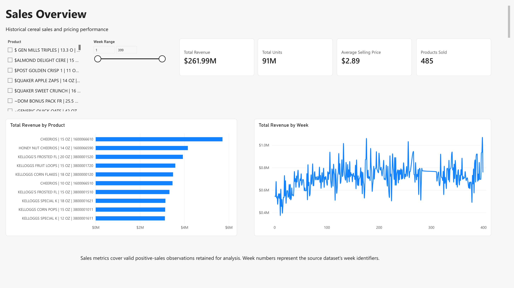
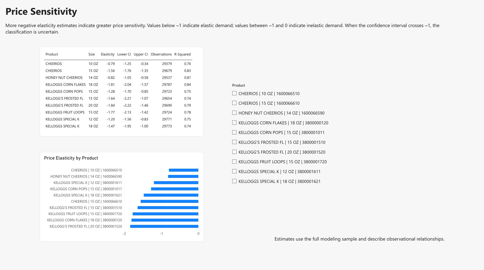
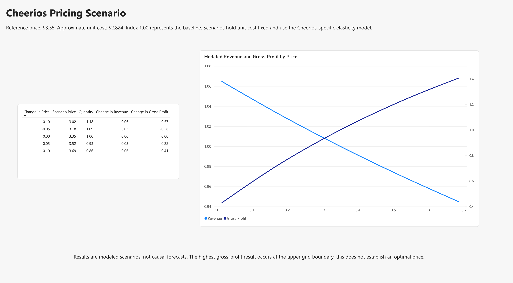

# Cereal Pricing and Price Elasticity Analysis

This project examines how cereal prices relate to demand and explores the tradeoff between sales volume, revenue, and approximate gross profit.

## Tools
- Python: data cleaning, exploratory analysis, and elasticity modeling
- DuckDB SQL: reporting tables, aggregation, and validation
- Power BI: interactive reporting and pricing scenario visualization

## Analysis
The project estimates price elasticities for the ten highest-revenue cereal products using promotion controls, store and week fixed effects, and standard errors clustered by store.

A separate Cheerios 15 oz case study evaluates price-change scenarios using a reference price of $3.35 and approximate unit cost of $2.824.

## Key Findings
- Estimated price sensitivity varies across products.
- Eight of the ten product point estimates are below −1.
- Some confidence intervals cross −1, making elastic-versus-inelastic classifications uncertain.
- For Cheerios 15 oz, a modeled 5% price increase reduces revenue by approximately 2.9% while increasing approximate gross profit by 22%.
- Modeled gross profit reaches its highest value at the upper boundary of the tested price grid; the analysis does not establish an optimal price.

## Project Structure
- `notebooks/`: cleaning, exploration, modeling, and SQL reporting
- `sql/`: reporting view definitions
- `outputs/python_results/`: exported model estimates and scenarios
- `outputs/powerbi/`: SQL reporting exports used in Power BI
- `dashboard/`: report screenshots and PDF

## Dashboard Preview

## Data and Reproduction
Raw data and the local database are not included in this repository.

The cleaning notebook expects `wcer.zip` and `upccer.csv` in `data/raw/`. Run the notebooks in numerical order to clean the data, estimate the models, and generate reporting exports.

Open notebooks from the repository root or the `notebooks/` directory; project paths are resolved automatically. Create `data/raw/` and place the two raw input files there before running notebook 01. The cleaning notebook creates `data/processed/` for its generated Parquet files.

Run notebooks 01–04 in numerical order. Notebook 03 writes model outputs to `outputs/python_results/`. Notebook 04 reads those files and writes the five Power BI input tables to `outputs/powerbi/`; the committed `dim_product.csv` and `weekly_sales.csv` are existing reporting exports.

[View the Cereal Pricing Analysis report](dashboard/Cereal%20Pricing%20Analysis.pdf)

## Limitations
Sales analysis retains valid positive-sales observations. Elasticity estimates are observational rather than causal. Pricing scenarios assume constant elasticity and fixed approximate unit cost derived from the dataset’s accounting margin field.

The portfolio and Cheerios scenario models use different promotion-control specifications.
